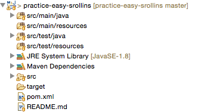

Development Environment
=======================

In this course we will use the following technologies for developing, testing, building, and submitting programs.

- [Eclipse](#eclipse)
- [Github](#github)
- [Maven](#maven)

Most students have their own laptop computer and find it helpful to bring it to class. If you do not have a laptop then you may use the laboratory computers on campus.

Most professors, and a majority of students, use Macs. Macs, Windows, and Linux computers are all fine. If you are thinking of a new computer and have the budget, a Mac is recommended. If not, any relatively modern laptop will serve you fine for this course. Much of the software is easier to work with on unix-based machines, however.

## Eclipse
Eclipse is an Integrated Development Environment (IDE) that provides a friendly interface for building large Java programs. If you wish you may use a different IDE, for example IntelliJ or NetBeans, or a text editor like Sublime Text along with the command line. The instructor and TAs will only provide support for Eclipse, however.

Make sure you are using Eclipse Mars or greater and that it is configured to use Java 8.

1. Download [Eclipse here](https://eclipse.org/). Select the Eclipse IDE for Java Developers.
2. Download [Java 8 here](http://www.oracle.com/technetwork/java/javase/downloads/index.html)
3. Make sure that Eclipse is configured correctly. `Eclipse > Preferences > Java > Compiler` should show a "Compiler compliance level" of 1.8 and `Installed JREs` should show Java SE 8. See the professor if you need help with this.

## Github
[Github](https://github.com/) is a web-based version control system. All notes and resources will be posted on github. In addition, all assignments will be distributed and submitted using github. 

Create a github user account if you do not already have one and sign up for the [Student Developer Pack](https://education.github.com/pack). This will be very useful throughout your CS career.

There are several ways to download code from and commit code to github.

1. [Command line](https://git-scm.com/book/en/v2/Getting-Started-Installing-Git) - If you are a Linux user, or if you want to prepare yourself for future CS classes you should use the command line.
2. [Egit](http://www.eclipse.org/egit/) - Eclipse has an integrated client that makes it easy to access git repositories. 
3. [Github Desktop](https://desktop.github.com/) - If you are a Mac or Windows users you may find it helpful to use the standalone client tool. 

The instructor will generally use some combination of 1 and 2. 

The instructor will use [Github Classroom](https://classroom.github.com/) to manage assignments. For each assignment, you will be provided with a link that you will click to create a new repository. When it is created, that repository will be seeded with skeleton code and test cases. You will download the repository and maintain and submit your code by committing to the repository.

For most assignments, you will follow the following procedure:

1. **Create Repo** - Use the link provided to create your initial repository.
2. **Clone** - Create an initial copy of the repository on your local computer.
3. **Edit/Test** - Edit and test your code. **Do not** modify the test files or any other configuration code provided.
3. **Add** - Add any files that have been modified. **Do not forget this step!**
4. **Commit** - Save the changes you just added.
5. **Push** - Upload the changes to the github servers.
6. **Take a break** - Sleep, shower, eat.
7. **Pull** - Before your start working again, make sure to download any changes. The instructor or TA may have made comments or edits to your code, or you may be working on multiple machines. It is always a good idea to make sure your local copy is consistent with what is on the github server before beginning work again.
8. **Repeat** - Start again at step 3.

It is *strongly* advised that you spend some time reading/watching git resources online. A good place to start is this set of [git videos](https://git-scm.com/videos).

<!--This video tutorial demonstrates how to use Eclipse and the Egit plugin to complete an assignment.

This video tutorial demonstrates how to use the git command line tools and Eclipse to complete an assignment.

-->
Commit your changes to Github *early and often*. You should *not* use Github as only a submission tool. Every time you get a new method or feature working *commit your changes to Github*! 

<!--## Loading Projects into Eclipse
1. Open Eclipse specifying the directory created by the Github tool (e.g., `/Users/srollins/cs601/srollins-labs`). Make sure to select the `<username>/labs` repository.
2. Right-click under the `Package Explorer` and select `New > Java Project`.
3. In the `Project name:` field, type `CS601Labs`. Make sure to specify this exactly as it will see that there is a directory with this name and automatically import its contents.
4. Click `Finish`.
5. Modify your build path to include JUnit by right-clicking on the project folder, selecting `Build Path > Add Libraries`, then selecting `JUnit`. 
6. You're done!

## Pulling Down New Projects
The instructor may add new projects to your repositories as new work is assigned. In the Github tool, simply `Sync` to pull down the latest updates from github. Then, follow the steps listed in the [Loading Projects into Eclipse](#loading-projects-into-eclipse) section to load the projects into Eclipse and begin work.
-->

## Maven

[Maven](https://maven.apache.org/) is a project management tool we will use for this class. It provides a useful way to describe how to build software and manage its dependencies. You will notice that your projects will contain a file `pom.xml`. This file specifies how to compile the project and any other packages on which the project depends. *Do not modify this file!* In most cases, the instructor will provide this file for you, and this file will be used by the instructor and TAs to grade your solution. 

## Getting Started

The instructions below demonstrate how to get started using Eclipse, the Egit plugin, and github to complete and submit a practice assignment.

### Create your repo

The instructor will provide you with a link to a README file that outlines the requirements of the assignment. The README will include a link that will allow you to create your own repository for the assignment at the bottom of the page under the heading **Submission Requirements**. 

1. Click the link.
2. Select `Accept this assignment`.
3. It can take a minute or two for the import to complete.

### Clone the repo

1. Visit the web page of your repository, which will look something like: `https://github.com/CS601-F18/practice-easy-<username>`
2. Select `Clone or download` and copy the web URL.
3. Open Eclipse, specifying the workspace where you want to put the new project.
4. Select `File` > `Import` > `Git` > `Projects from Git`.
5. Select `Clone URI`.
6. In the URI field, enter the URL from step #2 and make sure your github credentials are correct.
7. In the Local Destination, make sure to select the directory where you want to store the code. It will default to a /.../git directory.
8. Select `Import as general project`.

At this point, you should now have a copy of your repository on your local computer.

### Convert to Maven Project

You will now need to tell Eclipse that this is not a "general" project, but a Maven project. Because of the way the github repos are set up (to allow students to use IDEs other than Eclipse) you cannot just import as a Maven project directly.

1. Right-click on the name of the project (e.g., `practice-easy-<username>`) in the Package Explorer.
2. Select `Configure` > `Convert to Maven Project`.

At this point, if you expand the project in your Package Explorer you should see something like the following:

### Edit your code

You may now edit your code.

:warning: Make sure that you do not modify anything in the `src/test/java` directory. 

You are expected to create your own test cases in addition to those provided. You can use JUnit and/or develop your own Driver classes to help you during development.

There are several ways to run the unit tests.

Option 1: To run an individual set of tests right-click on the JUnit test class (e.g., `SayHelloTest.java`) and select `Run As` > `JUnit Test`.

Option 2: To run all tests right-click on the project and select `Run As` > `Maven test`.

Of course, you can also run from the command line, using either Java or Maven.

### Commit your changes

:warning: Commit your changes early and often! I cannot stress this enough. You should commit your changes anytime you make any change to your code.

1. Right-click on the project and select `Team` > `Add to index`.
2. Right-click on the project and select `Team` > `Commit`. This should bring up the Git Staging view and you should see one or more files under `Staged Changes` (bottom left pane).
3. You do *not* need to commit any of the Eclipse configuration files including `.classpath`, `.project`, any the files in `.settings`.
4. In the right pane enter a `Commit Message`. This should be a description of the change you are committing. It is important that this be a useful message, for example "Completed sayHello method -- SayHello tests passing.".
5. Select `Commit and Push`. This will push your changes to github!

:warning: It is very important that you select `Commit and Push`. If you just select `Commit` then your changes will not appear on github.

**Double check** your solution was pushed to github. Visit the repository URL and verify that the code that is checked in is the code you intended to push. *Do not skip this step!* 

<!--## Travis

[Travis CI](https://travis-ci.com/) is a continuous integration tool. For every assignment, once your repository is created the instructor will configure Travis CI to automatically build and run the project test cases every time you commit your code to github. After your repository has been enabled, you may check the status of your latest commit by using your github credentials to log in to [https://travis-ci.com/profile/](https://travis-ci.com/profile/).

If the test cases aren't passing, you know you have more work to do! 

:warning: You should not rely on Travis CI to test your code for you. You should create your own local test cases and also run the provided test cases on your local machine before committing.

The `.travis.yml` file in each of your assignment repositories contains the configuration information necessary to trigger the automated build and test of your program when committed to github. *Do not modify this file!*-->

